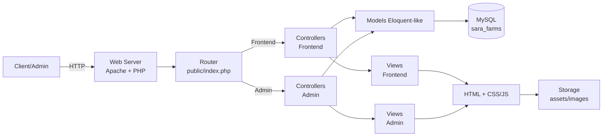

# Sara Farms

<p align="center">
  <a href="#fr">🇫🇷 Français</a>
</p>

<a id="fr"></a>

Plateforme e-commerce web pour la **vente de produits agricoles** et de **services agronomiques** avec gestion complète du catalogue, panier, commandes, paiements mobiles, suivi des stocks, gestion financière et administration avancée.

## Sommaire

- [Aperçu](#aperçu)
- [Fonctionnalités principales](#fonctionnalités-principales)
- [Stack technique](#stack-technique)
- [Architecture](#architecture)
- [Captures d'écran](#captures-décran)
- [Installation locale](#installation-locale)
- [Configuration](#configuration)
- [Lancement en développement](#lancement-en-développement)
- [Base de données](#base-de-données)
- [Comptes et rôles](#comptes-et-rôles)
- [Routes principales](#routes-principales)
- [Sécurité et permissions](#sécurité-et-permissions)
- [Structure du projet](#structure-du-projet)
- [Qualité et tests](#qualité-et-tests)
- [Roadmap](#roadmap)
- [Licence](#licence)

---

## Aperçu

**Sara Farms** est une application PHP full-stack conçue pour:

- permettre aux agriculteurs et consommateurs d'acheter des produits agricoles de qualité (œufs, maïs, volaille, légumes, semences, miel, produits laitiers, engrais organiques),
- gérer un catalogue produits dynamique avec stocks en temps réel,
- offrir deux modes de paiement (livraison à crédit et Mobile Money),
- tracer tous les mouvements de stocks et les entrées matières premières,
- proposer une vision complète financière (revenus, dépenses, marges),
- donner à l'administrateur un contrôle total sur les commandes, produits et finances.

Le projet est conçu pour un usage réel: workflow par rôle, restrictions d'accès strictes, audit trail complet des transactions, et interface moderne responsive.

---

## Fonctionnalités principales

### 1) Authentification et profils

- Authentification sécurisée (register/login/logout) avec hachage bcrypt.
- Rôles applicatifs:
  - `client`: accès boutique, panier, commandes
  - `admin`: accès dashboard et gestion complète
- Contrôle de session avec redirections basées sur le rôle.

### 2) Catalogue de produits

- **9 produits par défaut** couvrant: œufs, maïs, volaille, légumes, semences, miel, produits laitiers, engrais, fromage.
- Prix et stocks synchronisés en temps réel.
- Affichage responsive avec fallback de données.
- Catégorisation implicite par type de produit.

### 3) Panier et checkout

- Panier basé session (`$_SESSION['cart']`).
- Ajout/suppression/mise à jour de quantités.
- Validation des stocks avant validations.
- **Subtotal et total en temps réel** avec formatage FCFA.
- Calculs en direct sans rechargement de page (JavaScript optimisé).

### 4) Paiements

- **Mode 1 (Livraison)**: paiement à la livraison (credit).
- **Mode 2 (Mobile Money)**: paiement mobile avec référence de transaction.
- Statut paiement tracké: `pending` → `completed` ou `failed`.
- Workflow indépendant selon mode.

### 5) Gestion des commandes

- Placement de commande par client avec sélection mode paiement.
- **Workflow admin**: visualisation, validation, ou rejet des commandes.
- Validation décrémente automatiquement les stocks.
- Historique d'état: `en_attente` → `validee` / `rejetee`.
- Détail commande avec liste produits, prix unitaires, quantités, totaux.

### 6) Gestion des stocks

- **Stocks produits**: synchronisés avec commandes validées.
- **Stocks matières premières**: inventaire séparé pour intrants de production.
- **Alertes bas stocks**: notification automatique des items critiques.
- **Mouvements tracés**: chaque modification loggée avec type (entrée/sortie/ajustement/consommation).
- Historique d'audit complet.

### 7) Finances et rapports

- **Ledger complet**: suivi revenus (ventes) et dépenses (achats matières).
- **Rapports mensuels**: revenue, expenses, profit, marge bénéficiaire.
- Filtrage par période.
- Intégration automatique à chaque transaction.

### 8) Dashboard administrateur

- **Statistiques 24h**: nombre commandes, montant total, clients actifs.
- **Alertes stocks**: matières premières en dessous du seuil.
- **Commandes récentes**: dernières soumissions à valider.
- **Nombre total clients**: suivi clientèle.

### 9) Services et contact

- Page services: informations sur activités (formations, livraison, support).
- Formulaire contact: permet clients de soumettre des demandes/questions.

---

## Stack technique

### Backend

- PHP `^8.3`
- Architecte MVC custom (vanilla PHP)
- PDO pour requêtes sécurisées
- Transactions MySQL pour atomicité
- Session-based authentication

### Frontend

- HTML5
- CSS3 (Glassmorphism, animations, responsive)
- JavaScript vanilla (Fetch API, Debouncing)
- Modules CSS: main.css, admin.css, responsive.css, animations.css, glassmorphism.css

### Base de données

- MySQL `^8.4.7`
- Charset UTF8MB4
- Migrations: schéma structure dans `database/schema.sql`

### Serveur

- WAMP64 (Apache + MySQL + PHP)
- Déploiement local: `http://localhost/sara_farms/public/`

---

## Architecture



### Middleware clés

- Session authentication
- Role-based access control (client vs admin)
- CSRF protection implicite (sessions)
- PDO prepared statements contre SQL injection

---

## Captures d'écran

Voici un aperçu visuel :


---

## Installation locale

### Prérequis

- PHP 8.3+
- MySQL 8.0+
- Apache (ou WAMP64/XAMPP)
- Navigateur moderne

### Étapes

```bash
# 1) Cloner/Télécharger le projet
git clone https://github.com/votre-org/sara_farms.git
cd Sara_Farms

# 2) Copier fichiers config (si nécessaire)
# Vérifier config/database.php, config/constants.php

# 3) Importer la base de données
# Créer database sara_farms dans MySQL
mysql -u root -p < database/schema.sql

# 4) Placer dans répertoire WAMP
# Copier dossier Sara_Farms vers: C:\wamp64\www\Sara_Farms

# 5) Accéder l'application
# http://localhost/sara_farms/public/
```

Application disponible sur:

- **Frontend**: `http://localhost/sara_farms/public/`
- **Admin**: `http://localhost/sara_farms/public/?url=admin/dashboard`

---

## Configuration

### Variables d'environnement

Fichier: `config/database.php`

```php
define('DB_HOST', 'localhost');
define('DB_USER', 'root');
define('DB_PASSWORD', '');
define('DB_NAME', 'sara_farms');
```

Fichier: `config/constants.php`

```php
define('APP_URL', 'http://localhost/sara_farms/public/');
define('APP_NAME', 'Sara Farms');
define('CURRENCY', 'FCFA');
```

Fichier: `config/session.php`

```php
session_start();
session_set_cookie_params([
    'lifetime' => 86400,
    'path' => '/sara_farms/public/',
    'secure' => false,  // true en production
    'httponly' => true
]);
```

---

## Lancement en développement

### Option simple

```bash
# 1) Terminal 1: MySQL (via WAMP control panel ou:)
# mysqld.exe (si en ligne de commande)

# 2) Terminal 2: Serveur Apache (via WAMP control panel)
# httpd.exe (si en ligne de commande)

# 3) Ouvrir navigateur
http://localhost/sara_farms/public/
```

### Vérification l'appli

```bash
# Test connexion DB
php test.php

# Devrait afficher:
# ✓ Base de données connectée
# ✓ Tables présentes
```

---

## Base de données

### Tables principales (9)

| Table | Description |
|-------|-------------|
| `users` | Clients et admins avec rôle, email, password |
| `products` | Catalogue produits (nom, prix, stock, catégorie, image) |
| `orders` | Commandes clients (date, total, statut, méthode paiement) |
| `order_items` | Lignes commande (produit, quantité, prix unitaire) |
| `raw_materials` | Stocks matières premières (nom, quantité, coût) |
| `stock_movements` | Audit trail (type mouvement, quantité, coût, référence) |
| `financial_records` | Ledger comptable (type transaction, montant, référence, date) |
| `contact_messages` | Messages contact (email, sujet, message, date) |
| `dashboard` | Statistiques agrégées (24h, mensuelles) |

### Schéma relations

```
users (1) ──────── (∞) orders
                        │
                        └─────── (∞) order_items ──────── (∞) products

products (1) ──────── (∞) stock_movements
raw_materials (1) ──── (∞) stock_movements

financial_records ← logged from orders & stock_movements
```

### Commandes utiles

```bash
# Réinitialiser DB (avec données de test)
mysql -u root -p < database/schema.sql

# Vérifier tables
mysql -u root -p -e "USE sara_farms; SHOW TABLES;"

# Lister colonnes table
mysql -u root -p -e "USE sara_farms; DESCRIBE products;"
```

---

## Comptes et rôles

### Rôles fonctionnels

- **`client`** (par défaut):
  - Accès boutique, panier, checkout.
  - Visualisation ses propres commandes.
  - Annulation commandes en attente.
  - Formulaire contact.

- **`admin`** (accès restreint):
  - Dashboard analytics.
  - Gestion produits (CRUD, stocks).
  - Gestion matières premières.
  - Validation/rejet commandes.
  - Rapports financiers.
  - Suivi stocks et alertes.

### Comptes de test (à la première installation)

Créer via formulaire register:

```
Email: client@test.com
Password: Test1234!
Role: client (auto)
---
Email: admin@sara-farms.com
Password: AdminPass123!
Role: admin (à modifier en DB après creation)
```

### Promouvoir utilisateur en admin (MySQL)

```sql
UPDATE users SET role = 'admin' WHERE email = 'user@email.com';
```

---

## Routes principales

### Public (non authentifié)

- `GET /?url=` → HomeController::index()
- `GET /?url=shop` → ShopController::index()
- `GET /?url=auth/login` → AuthController::login()
- `GET /?url=auth/register` → AuthController::register()
- `GET /?url=services` → ServicesController::index()
- `GET /?url=contact` → ContactController::index()

### Authentifié (Client)

- `GET /?url=cart` → CartController::index()
- `POST /?url=cart/add/productId` → CartController::add(productId)
- `POST /?url=cart/remove/productId` → CartController::remove(productId)
- `POST /?url=cart/update/productId` → CartController::update(productId)
- `POST /?url=cart/checkout` → CartController::checkout()
- `GET /?url=orders` → OrderController::index()
- `GET /?url=orders/detail/orderId` → OrderController::detail(orderId)
- `POST /?url=orders/cancel/orderId` → OrderController::cancel(orderId)
- `POST /?url=orders/confirmMobileMoneyPayment` → OrderController::confirmMobileMoneyPayment()

### Admin

- `GET /?url=admin/dashboard` → DashboardController::index()
- `GET /?url=admin/products` → ProductController::index()
- `GET /?url=admin/products/create` → ProductController::create()
- `POST /?url=admin/products/store` → ProductController::store()
- `GET /?url=admin/products/edit/productId` → ProductController::edit(productId)
- `POST /?url=admin/products/update/productId` → ProductController::update(productId)
- `POST /?url=admin/products/delete/productId` → ProductController::delete(productId)
- `GET /?url=admin/stock` → StockController::index()
- `GET /?url=admin/stock/create` → StockController::create()
- `POST /?url=admin/stock/addStock` → StockController::addStock()
- `GET /?url=admin/orders` → OrderManagementController::index()
- `GET /?url=admin/orders/detail/orderId` → OrderManagementController::detail(orderId)
- `POST /?url=admin/orders/validate/orderId` → OrderManagementController::validate(orderId)
- `POST /?url=admin/orders/reject/orderId` → OrderManagementController::reject(orderId)
- `GET /?url=admin/finance` → FinanceController::index()

---

## Sécurité et permissions

### Protections implémentées

- **SQL Injection**: Prepared statements PDO systématiques sur toutes requêtes.
- **Authentication**: Sessions sécurisées avec hachage bcrypt, cookies HttpOnly.
- **Role-based access**: Middleware implicite dans chaque controller vérifiant `$_SESSION['user_id']` et `$_SESSION['role']`.
- **Stock safety**: Vérification disponibilité avant décréments (prevents overselling).
- **Transaction atomicity**: Transactions MySQL sur checkout et validation commande.
- **Soft deletes**: Produits marqués `is_active = 0` au lieu suppression définitive.

### Checklist sécurité

- [ ] `config/database.php`: user/password MySQL sécurisés
- [ ] `config/session.php`: `secure=true` et domaine correct en production
- [ ] Fichiers uploads: whitelist extensions autorisées (jpg, png, webp)
- [ ] Rate limiting: ajouter limit tentatives login
- [ ] HTTPS: déployer certificat SSL en production
- [ ] Input validation: renforcer côté serveur validations formulaires

---

## Structure du projet

```text
Sara_Farms/
├── app/
│   ├── controllers/
│   │   ├── AuthController.php
│   │   ├── HomeController.php
│   │   ├── ShopController.php
│   │   ├── CartController.php
│   │   ├── OrderController.php
│   │   ├── ServicesController.php
│   │   ├── ContactController.php
│   │   └── admin/
│   │       ├── DashboardController.php
│   │       ├── ProductController.php
│   │       ├── StockController.php
│   │       ├── FinanceController.php
│   │       └── OrderManagementController.php
│   ├── models/
│   │   ├── User.php
│   │   ├── Product.php
│   │   ├── Order.php
│   │   ├── OrderItem.php
│   │   ├── RawMaterial.php
│   │   ├── StockMovement.php
│   │   ├── FinancialRecord.php
│   │   ├── Dashboard.php
│   │   └── Contact.php
│   └── views/
│       ├── layouts/
│       │   ├── header.php
│       │   ├── footer.php
│       │   ├── admin-header.php
│       │   ├── admin-sidebar.php
│       │   └── admin-footer.php
│       ├── frontend/
│       │   ├── auth/
│       │   ├── home/
│       │   ├── shop/
│       │   ├── services/
│       │   └── contact/
│       └── admin/
│           ├── dashboard/
│           ├── products/
│           ├── stock/
│           ├── orders/
│           └── finance/
├── config/
│   ├── database.php
│   ├── constants.php
│   └── session.php
├── core/
│   ├── Controller.php
│   └── Model.php
├── database/
│   └── schema.sql
├── includes/
│   ├── functions.php
│   ├── helpers.php
│   └── validator.php
├── public/
│   ├── index.php (router)
│   ├── test.php (db test)
│   └── assets/
│       ├── css/
│       │   ├── main.css
│       │   ├── admin.css
│       │   ├── responsive.css
│       │   ├── animations.css
│       │   └── glassmorphism.css
│       ├── js/
│       │   ├── main.js
│       │   ├── cart.js
│       │   ├── charts.js
│       │   └── stock-alert.js
│       └── images/
│           ├── uploads/
│           └── hero-section.png
├── docs/
│   └── images/ (screenshots)
└── README.md
```

---

## Qualité et tests

### Tests connexion DB

```bash
php public/test.php
```

Résultat attendu:

```
✓ Connexion à la base de données réussie!
✓ Tables présentes et accessibles.
```

### Validation code

```bash
# Vérifier syntaxe PHP
php -l app/controllers/HomeController.php
php -l app/models/Product.php

# Ou pour tous fichiers:
find app -name "*.php" -exec php -l {} \;
```

### Tests manuels recommandés

1. **Auth**: Register → Login → Logout
2. **Shop**: Parcourir produits → Ajouter au panier
3. **Cart**: Modifier quantités → Checkout (livraison) → Checkout (mobile money)
4. **Admin**: Valider commande → Vérifier stocks décrémentés
5. **Finance**: Valider rapport mensuel

---

## Roadmap

### Phase 1 (Terminé)
- [x] Catalogue produits dynamique
- [x] Panier session optimisé (real-time updates)
- [x] Dual payment modes (livraison + Mobile Money)
- [x] Admin order workflow
- [x] Stock tracking avec mouvements audit
- [x] Financial ledger complet
- [x] Responsive design (mobile-first)
- [x] Glassmorphism UI moderne

### Phase 2 (Planifié)
- [ ] Système authentification + 2FA
- [ ] Profils clients enrichis (adresse, téléphone, historique)
- [ ] Notifications email (commande confirmée, expédiée)
- [ ] Export PDF factures et rapports
- [ ] Dashboard charts analytics (Charts.js intégré)
- [ ] Paging et virtualisation listes admin

### Phase 3 (Backlog)
- [ ] Système catégories dynamiques
- [ ] Promotion/discount codes
- [ ] Wishlist utilisateurs
- [ ] Reviews & ratings produits
- [ ] Live chat support
- [ ] SMS Mobile Money notifications
- [ ] Multi-langue i18n (FR/EN)

---

## Contribution

Propositions bienvenues! Pour contribuer:

1. Fork le projet
2. Créer une branche feature (`git checkout -b feature/new-feature`)
3. Commit changements (`git commit -am 'Add new feature'`)
4. Push vers la branche (`git push origin feature/new-feature`)
5. Ouvrir Pull Request

---

## Licence

Ce projet est sous licence **MIT**. Voir le fichier [LICENSE](LICENSE) pour détails.

---

## Contact & Support

- **Email**: contact.fulbert@gmail.com
- **Website**: https://dnanga.vercel.app/
- **Issues**: GitHub Issues pour bugs et feature requests

---

**Dernière mise à jour**: Juin 2026 | **Version**: 1.0.0
