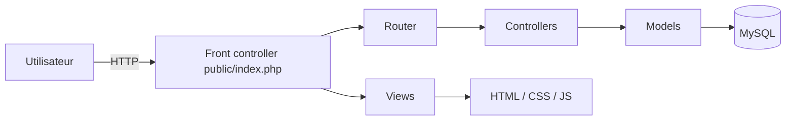

# Sara Farms

<p align="center">
  <a href="#fr">🇫🇷 Français</a>
</p>

<a id="fr"></a>

Application web de gestion d'une ferme agricole polyvalente au Togo, conçue pour le suivi des stocks, des cultures, des interventions et des commandes, avec un tableau de bord administratif moderne et responsive.

## Sommaire

- [Aperçu](#aperçu)
- [Fonctionnalités principales](#fonctionnalités-principales)
- [Stack technique](#stack-technique)
- [Architecture](#architecture)
- [Installation locale](#installation-locale)
- [Configuration](#configuration)
- [Lancement en développement](#lancement-en-développement)
- [Base de données](#base-de-données)
- [Comptes et rôles](#comptes-et-rôles)
- [Routes principales](#routes-principales)
- [Sécurité et permissions](#sécurité-et-permissions)
- [Structure du projet](#structure-du-projet)
- [Qualité et tests](#qualité-et-tests)
- [Roadmap](#roadmap)
- [Licence](#licence)

---

## Aperçu

**Sara Farms** est une application PHP native orientée MVC pour la gestion d'une exploitation agricole. Elle offre :

- un contrôle précis des stocks d'intrants,
- le suivi des cultures et des parcelles,
- l'enregistrement des interventions des ouvriers,
- un catalogue de produits à destination de la vente,
- un tableau de bord administratif responsive.

Le projet privilégie une interface minimaliste, un design glassmorphism inspiré d'une esthétique professionnelle, et une compatibilité mobile forte pour une utilisation sur le terrain.

---

## Fonctionnalités principales

### 1) Authentification et sessions

- Gestion des sessions PHP sécurisées.
- Bcrypt pour le hachage des mots de passe.
- Redirection selon le rôle utilisateur.
- Protection des pages administratives et publiques.

### 2) Gestion des stocks

- Modèle `Stock` pour récupérer tous les intrants.
- Détection des intrants en alerte selon le seuil défini.
- Mise à jour des quantités disponibles.
- Tableau de bord avec alertes de stocks bas.

### 3) Suivi des cultures et interventions

- Suivi des parcelles avec date de semis et de récolte prévue.
- Enregistrement des interventions par culture.
- Statut des cultures et rapports de production.

### 4) Catalogue de produits

- Liste des produits prêts pour la vitrine publique.
- Affichage du stock disponible.
- Prix unitaire et unité de vente.

### 5) Dashboard administratif

- Indicateurs clés (KPI) stylisés en glassmorphism.
- Graphique d'évolution des ventes avec Chart.js.
- Tableau des intrants en rupture ou en stock bas.

---

## Stack technique

### Backend

- PHP natif
- PDO MySQL
- Architecture MVC

### Frontend

- HTML5
- CSS3 pur (Grid / Flexbox)
- Vanilla JavaScript
- Chart.js pour le graphique

### Base de données

- MySQL / MariaDB
- Encodage UTF-8 (utf8mb4)

---

## Architecture



---

## Installation locale

### Prérequis

- PHP 8.0+
- MySQL ou MariaDB
- WAMP / XAMPP / LAMP
- Navigateur moderne

### Étapes

```bash
# Copier le projet dans le dossier web
# Exemple WAMP : C:\wamp64\www\Sara_Farms

# Installer la base de données
# Si nécessaire, exécuter database/schema.sql dans phpMyAdmin ou via la CLI MySQL.
```

---

## Configuration

### Base de données

Vérifier les paramètres de connexion dans `config/db.php` :

- `host`
- `database`
- `user`
- `password`

Le fichier initialise aussi la base `sara_farms` et crée les tables si elles n'existent pas.

---

## Lancement en développement

Ouvrir l'URL suivante dans le navigateur :

```text
http://localhost/Sara Farms/public/index.php
```

ou avec réécriture d'URL si Apache est configuré :

```text
http://localhost/Sara Farms/
```

---

## Base de données

Le script SQL principal est disponible dans `database/schema.sql`.

### Tables clés

- `roles`
- `utilisateurs`
- `intrants`
- `cultures`
- `interventions`
- `produits_catalogue`
- `commandes`
- `details_commandes`

---

## Comptes et rôles

### Rôles fonctionnels

- `admin` : accès au tableau de bord et aux fonctions administratives.
- `employe` : accès aux saisies de terrain et aux interventions.
- `client` : accès au catalogue public.

### Exemple d'initialisation

Le projet initialise automatiquement les rôles dans la base de données via `config/db.php`.

---

## Routes principales

- `?route=home` : page d'accueil publique.
- `?route=catalogue` : catalogue des produits.
- `?route=login` : page de connexion.
- `?route=dashboard` : tableau de bord administrateur.
- `?route=logout` : déconnexion.

---

## Sécurité et permissions

- Requêtes PDO préparées pour éviter les injections SQL.
- `htmlspecialchars()` pour protéger les affichages contre le XSS.
- Nettoyage des textes pour supprimer les emojis avant insertion.
- Sessions PHP sécurisées avec destruction complète à la déconnexion.

---

## Structure du projet

```text
sara-farms/
├── config/
│   └── db.php
├── app/
│   ├── Core/
│   │   └── Router.php
│   ├── Controllers/
│   │   ├── AuthController.php
│   │   ├── ProductionController.php
│   │   └── StockController.php
│   └── Models/
│       ├── Culture.php
│       ├── Stock.php
│       ├── User.php
│       └── Vente.php
├── public/
│   ├── assets/
│   │   ├── css/
│   │   ├── js/
│   │   └── svg/
│   └── index.php
├── views/
│   ├── admin/
│   ├── layouts/
│   └── public/
├── database/
│   └── schema.sql
└── .htaccess
```

---

## Qualité et tests

- Code PHP orienté objet et commenté en français.
- CSS structuré autour de variables de design.
- Aucune dépendance front-end externe.

---

## Roadmap

- Ajouter le CRUD complet des intrants.
- Mettre en place la gestion des commandes client.
- Ajouter le suivi des interventions par employé.
- Développer un espace public de contact et de vitrine.
- Renforcer la validation et les tests.

---

## Licence

Projet académique développé pour la Licence 3 en Génie Logiciel.
